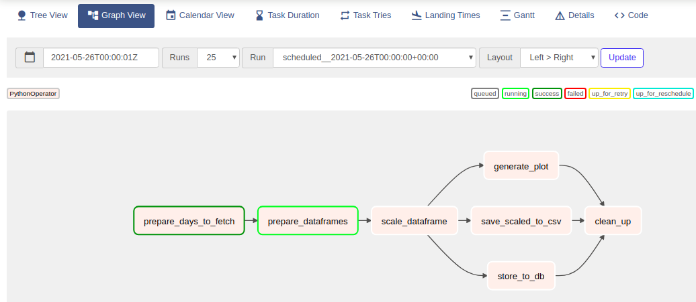

# Apache Airflow Demo
The purpose of this project is to demonstrate a data pipeline
using Apache Airflow, the data pipeline works on collecting a COVID 19
datasets collected from multiple sources from 
[https://raw.githubusercontent.com/CSSEGISandData/COVID-19](https://raw.githubusercontent.com/CSSEGISandData/COVID-19),
 the pipeline collects data within a date range for a specific region and province 
 then store it to a postgres database (by default to airflow postgres database).

## Data pipeline operators
The [DAG](docs/01-demo-dag.png) defines the data pipeline which 
consist of seven operators, starting from collecting data from
the website according to date ranges, filter them according to a region and
province-state, then in parallel: store them to a CSV file, generate a plot
for all metrics in the datasets, and store them to postgres, then do the proper
clean up
