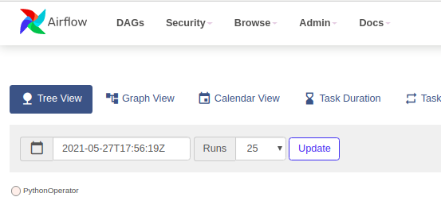
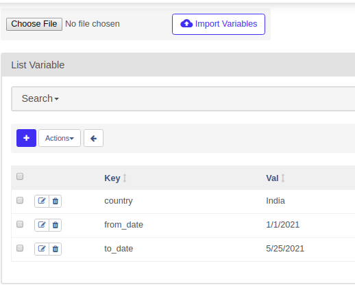

# Apache Airflow Demo
The purpose of this project is to demonstrate a data pipeline
using Apache Airflow, the data pipeline works on collecting a COVID 19
datasets collected from multiple sources from 
[https://raw.githubusercontent.com/CSSEGISandData/COVID-19](https://raw.githubusercontent.com/CSSEGISandData/COVID-19),
 the pipeline collects data within a date range for a specific region and province 
 then store it to a postgres database (by default to airflow postgres database).

## How to run
This demo uses docker-compose to run the application, you might need to grant proper permissions
to volumns folder under execution directory, to run the demo, navigate to this 
project path after cloning it then execute below:

```shell script
docker-compose up
```
Use CTRL+C to stop the application or by using docker-compose:

```shell script
docker-compose down
```

## Data pipeline operators
The [DAG](docs/01-demo-dag.png) defines the data pipeline which 
consist of seven operators, starting from collecting data from
the website according to date ranges, filter them according to a region and
province-state, then in parallel: store them to a CSV file, generate a plot
for all metrics in the datasets, and store them to postgres, then do the proper
clean up


## Configure the data pipeline environments
The data pipeline uses a list of variables to operate with default values, you can
modify through airflow web console through variables:

| Variable name  | Description                                                         | Default Value  |
|----------------|---------------------------------------------------------------------|----------------|
| from_date      | The date from which to start fetching datasets in format MM/dd/yyyy | 9/1/2020       |
| to_date        | The last date to fetch datasets in format MM/dd/yyyy                | 5/30/2021      |
| country        | The country to select the records for                               | United Kingdom |
| province_state | The province-state to select the records for                        | England        |

Through Airflow web console you can modify the variables, see snapshot below:



You can use the add button to add the variables



## Data pipeline output
The data pipeline stores final data to postgres, generate a plot for the fetched records,
and generates a CSV file for the fetched records. The output files are generated to
a shared volumn which can be viewed under project path under volumes/reports. 